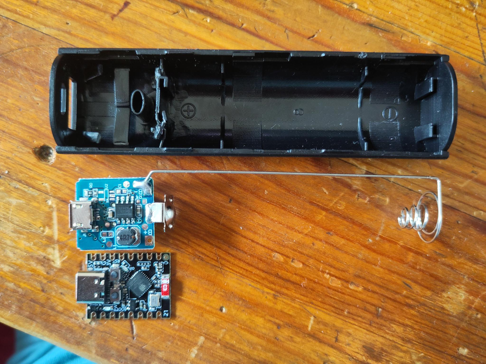
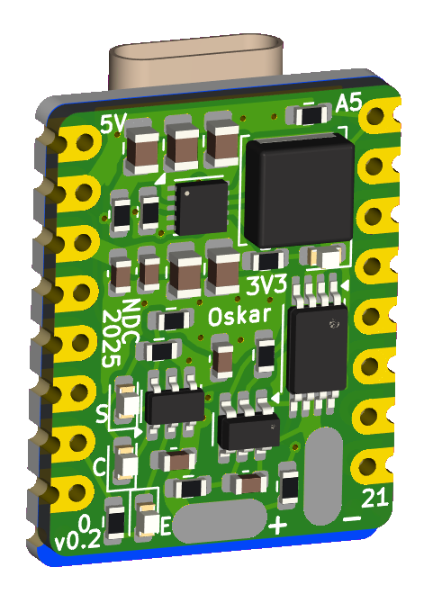

The idea is to put an ESP32 S3 Mini together with a Li-Ion charger and a 3.3V buck-boost regulator into this case:

So i'm going to put a small PCB on the backside of the ESP32 module:

I already tested it and even though it's tight, it should fit.
